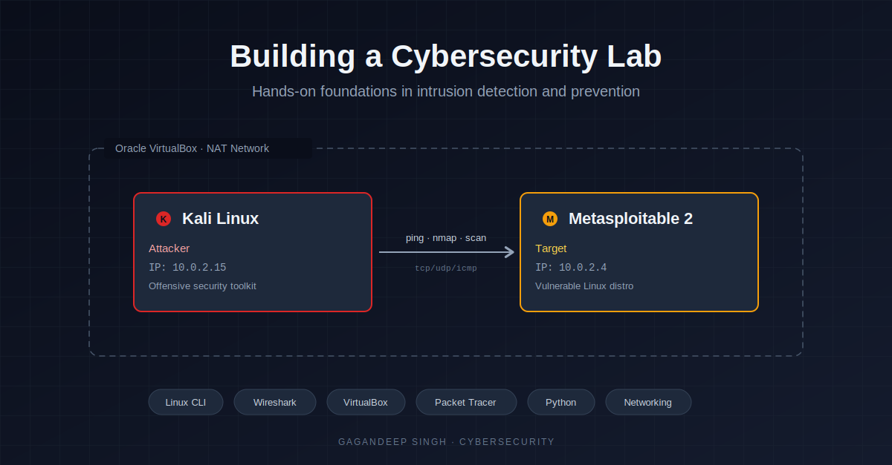

# Intrusion Detection Lab

A hands-on cybersecurity lab built for practicing intrusion detection, network analysis, and offensive security techniques in a safe, isolated environment.

---

## About this repository

This repository documents hands-on cybersecurity work — building a personal lab environment, learning the Linux command line, analyzing network traffic, and practicing the foundational techniques used by SOC analysts, penetration testers, and incident responders.

Each section is structured so anyone can follow along, replicate the setup, and learn the same skills.

---

## Lab architecture

The lab consists of two virtual machines running on Oracle VirtualBox, connected through an isolated NAT network:

| Machine | Role | Description |
|---------|------|-------------|
| **Kali Linux** | Attacker | Pre-loaded with offensive security tools (nmap, Metasploit, Wireshark, etc.) |
| **Metasploitable 2** | Target | An intentionally vulnerable Linux distribution for safe practice |

Both VMs sit on a private NAT network so they can communicate with each other but remain isolated from the host machine and the internet. Network isolation is non-negotiable when working with deliberately vulnerable software.

---

## Repository contents

### [01 — Environment setup](01-environment-setup/)
Step-by-step build of the lab: VirtualBox installation, NAT network configuration, Kali Linux and Metasploitable 2 deployment, and connectivity verification.

### [02 — Kali fundamentals](02-kali-fundamentals/)
Linux command line essentials practiced inside Kali — file system navigation, permissions, process management, log inspection, and networking commands.

### [scripts/](scripts/)
Python scripts and utilities used or created during the lab work.

---

## Skills demonstrated

- **Virtualization** — Oracle VirtualBox, NAT networks, VM configuration
- **Linux administration** — file system, permissions, processes, services, logs
- **Network analysis** — Wireshark, packet capture, ARP, ICMP
- **Network design** — Cisco Packet Tracer topology, multi-router configurations
- **Scripting** — Python fundamentals for automation and security tooling
- **Documentation** — clear, reproducible technical write-ups

---

## What's next

Planned additions to this repository:
- Network reconnaissance and enumeration with nmap
- Vulnerability scanning and exploitation against Metasploitable 2
- IDS deployment and tuning (Snort / Suricata)
- Log analysis and detection engineering
- Incident response workflow examples

---

## Connect

I'm Gagandeep Singh, a cybersecurity practitioner sharing my hands-on work publicly.

- 📝 [LinkedIn](#) — full write-ups and reflections
- 💼 Open to opportunities in cybersecurity (SOC analyst, penetration testing, threat detection, incident response)

If you're learning alongside me, hiring in the space, or just want to talk security — reach out.

---

## License

This work is released under the [MIT License](LICENSE).

> **Disclaimer:** All techniques, tools, and exercises in this repository are intended strictly for educational purposes within an isolated lab environment. Do not use them on systems or networks you do not own or have explicit written permission to test.
